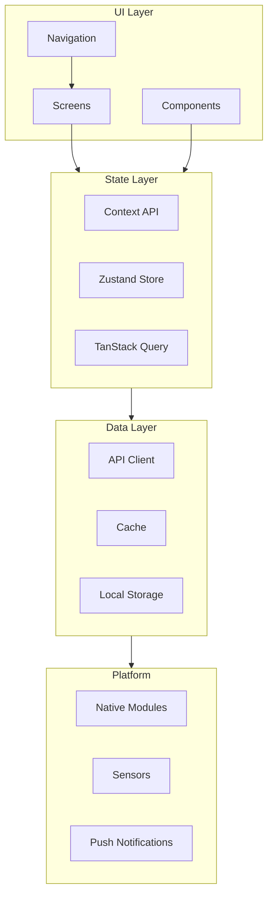
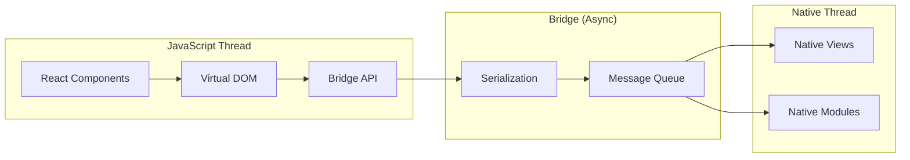
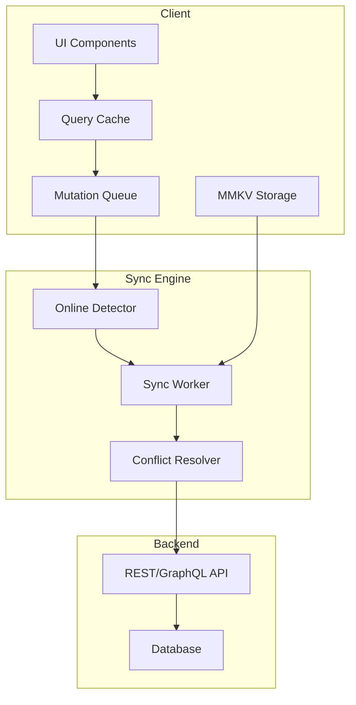

# Phase 9 — Visuals & Documentation

> Good diagrams are worth a thousand words. This phase provides Mermaid diagrams and ASCII art for architecture, data flow, and process visualization.

---

## Table of Contents

1. [Architecture Diagrams (Mermaid)](#1-architecture-diagrams-mermaid)
2. [Data Flow Diagrams](#2-data-flow-diagrams)
3. [ASCII Diagrams for Whiteboard Practice](#3-ascii-diagrams-for-whiteboard-practice)

---

## 1. Architecture Diagrams (Mermaid)

### App Architecture Overview



### React Native Bridge Architecture



### Offline-First Architecture



---

## 2. Data Flow Diagrams

### State Management Data Flow

```
┌─────────────────────────────────────────────────────────────────┐
│                    REACT DATA FLOW                               │
├─────────────────────────────────────────────────────────────────┤
│                                                                 │
│  ┌──────────────┐     ┌──────────────┐     ┌──────────────┐  │
│  │   useState   │ ←── │    Event     │ ←── │    User      │  │
│  │   (State)    │     │   Handler    │     │  Interaction │  │
│  └──────┬───────┘     └──────────────┘     └──────────────┘  │
│         │                                                       │
│         │ setState()                                           │
│         ▼                                                       │
│  ┌──────────────┐     ┌──────────────┐     ┌──────────────┐  │
│  │    Re-      │ ──▶ │  Virtual DOM  │ ──▶ │   Real DOM   │  │
│  │   render    │     │   Diffing     │     │   Updates    │  │
│  └──────────────┘     └──────────────┘     └──────────────┘  │
│                                                                 │
└─────────────────────────────────────────────────────────────────┘
```

### TanStack Query Flow

```
┌─────────────────────────────────────────────────────────────────┐
│                 TANSTACK QUERY FLOW                              │
├─────────────────────────────────────────────────────────────────┤
│                                                                 │
│  1. Query Created                                              │
│     ┌────────────────┐                                          │
│     │ useQuery()    │                                          │
│     └───────┬────────┘                                          │
│             │ Query Key: ["users"]                               │
│             ▼                                                   │
│  2. Check Cache                                                │
│     ┌────────────────┐     ┌────────────────┐                │
│     │  Cache Valid?  │ ──▶ │ Return Cache   │                │
│     └───────┬────────┘     └────────────────┘                │
│             │ No                                                      │
│             ▼                                                   │
│  3. Fetch from API                                             │
│     ┌────────────────┐                                          │
│     │ fetchUsers()  │                                          │
│     └───────┬────────┘                                          │
│             │                                                      │
│             ▼                                                   │
│  4. Update Cache                                               │
│     ┌────────────────┐                                          │
│     │ Set Query Data │                                          │
│     └───────┬────────┘                                          │
│             │                                                      │
│             ▼                                                   │
│  5. Component Re-render                                         │
│     ┌────────────────┐                                          │
│     │  UI Updated   │                                          │
│     └────────────────┘                                          │
│                                                                 │
└─────────────────────────────────────────────────────────────────┘
```

### Navigation Flow

```
┌─────────────────────────────────────────────────────────────────┐
│                 NAVIGATION FLOW                                  │
├─────────────────────────────────────────────────────────────────┤
│                                                                 │
│  User Action                                                    │
│       │                                                         │
│       ▼                                                         │
│  ┌────────────────┐                                            │
│  │ router.push()  │ ── or ── Link Component                    │
│  └───────┬────────┘                                            │
│          │                                                      │
│          ▼                                                      │
│  ┌────────────────┐                                            │
│  │ Navigation     │                                            │
│  │ State Updated  │                                            │
│  └───────┬────────┘                                            │
│          │                                                      │
│          ▼                                                      │
│  ┌────────────────┐                                            │
│  │ Find Matching  │ ── Uses route config                       │
│  │ Route          │                                            │
│  └───────┬────────┘                                            │
│          │                                                      │
│          ▼                                                      │
│  ┌────────────────┐                                            │
│  │ Component      │ ── Creates new screen                      │
│  │ Mounted       │                                            │
│  └───────┬────────┘                                            │
│          │                                                      │
│          ▼                                                      │
│  ┌────────────────┐                                            │
│  │ Screen        │ ── useEffect runs                           │
│  │ Initialized   │                                            │
│  └────────────────┘                                            │
│                                                                 │
└─────────────────────────────────────────────────────────────────┘
```

---

## 3. ASCII Diagrams for Whiteboard Practice

### React Native Architecture

```
┌────────────────────────────────────────────────────────────┐
│                    REACT NATIVE ARCHITECTURE                 │
├────────────────────────────────────────────────────────────┤
│                                                            │
│                         JAVASCRIPT                          │
│  ┌────────────────────────────────────────────────────┐   │
│  │  React Components                                  │   │
│  │     │                                              │   │
│  │     ▼                                              │   │
│  │  Virtual DOM                                       │   │
│  │     │                                              │   │
│  │     ▼                                              │   │
│  │  Shadow Tree                                      │   │
│  └────────────────────────────────────────────────────┘   │
│                          │                                  │
│                    ┌─────┴─────┐                           │
│                    │   BRIDGE   │  (Async Serialization)   │
│                    └─────┬─────┘                           │
│                          │                                  │
│           ┌──────────────┴──────────────┐                 │
│           │                              │                 │
│           ▼                              ▼                 │
│    ┌──────────────┐              ┌──────────────┐        │
│    │   iOS        │              │   Android    │        │
│    │  UIKit       │              │   Views      │        │
│    └──────────────┘              └──────────────┘        │
│                                                            │
└────────────────────────────────────────────────────────────┘
```

### FlatList Virtualization

```
┌────────────────────────────────────────────────────────────┐
│                 FLATLIST WINDOWING                          │
├────────────────────────────────────────────────────────────┤
│                                                            │
│  ┌──────────────────────────────────────────────┐         │
│  │              VIEWPORT (Visible)                │         │
│  │  ┌────────────────────────────────────────┐  │         │
│  │  │         Item 3 (Rendered)              │  │         │
│  │  ├────────────────────────────────────────┤  │         │
│  │  │         Item 4 (Rendered)              │  │         │
│  │  ├────────────────────────────────────────┤  │         │
│  │  │         Item 5 (Rendered)              │  │         │
│  │  └────────────────────────────────────────┘  │         │
│  └──────────────────────────────────────────────┘         │
│                                                            │
│  Items above viewport (Recycled)                          │
│  ┌────────────┐  ┌────────────┐  ┌────────────┐         │
│  │  Item 0    │  │  Item 1    │  │  Item 2    │         │
│  │  (Cached)  │  │  (Cached)  │  │  (Cached)  │         │
│  └────────────┘  └────────────┘  └────────────┘         │
│                                                            │
│  Items below viewport (Recycled)                          │
│  ┌────────────┐  ┌────────────┐  ┌────────────┐         │
│  │  Item 6    │  │  Item 7    │  │  Item 8    │         │
│  │  (Cached)  │  │  (Cached)  │  │  (Cached)  │         │
│  └────────────┘  └────────────┘  └────────────┘         │
│                                                            │
│  windowSize = 5  (Renders 5 screens of content)          │
│                                                            │
└────────────────────────────────────────────────────────────┘
```

### Event Loop in React Native

```
┌────────────────────────────────────────────────────────────┐
│                  REACT NATIVE EVENT LOOP                    │
├────────────────────────────────────────────────────────────┤
│                                                            │
│  1. JS Thread                                              │
│     ┌─────────┐    ┌─────────┐    ┌─────────┐            │
│     │  Event  │───▶│  Task   │───▶│ Callback │            │
│     │  Queue  │    │  Queue  │    │  Queue   │            │
│     └─────────┘    └─────────┘    └────┬────┘            │
│                                         │                   │
│                                         ▼                   │
│     ┌──────────────────────────────────────────┐          │
│     │         JavaScript Execution              │          │
│     │  - Component renders                      │          │
│     │  - State updates                          │          │
│     │  - Effects                                │          │
│     └────────────────────┬─────────────────────┘          │
│                          │                                  │
│     ┌────────────────────┼─────────────────────┐          │
│     │                    │                    │          │
│     ▼                    ▼                    ▼          │
│  ┌──────┐          ┌──────────┐         ┌──────────┐      │
│  │Bridge│          │  Native  │         │  Bridge  │      │
│  │Write │          │  Process │         │   Read   │      │
│  └──┬───┘          └────┬─────┘         └────┬────┘      │
│     │                   │                    │          │
│     ▼                   ▼                    ▼          │
│  ┌──────┐          ┌──────────┐         ┌──────────┐      │
│  │ iOS/ │          │ UI/Render│         │  Event   │      │
│  │Android│          │ Updates  │         │ Handlers │      │
│  └──────┘          └──────────┘         └──────────┘      │
│                                                            │
└────────────────────────────────────────────────────────────┘
```

### State Management Comparison

```
┌────────────────────────────────────────────────────────────┐
│              STATE MANAGEMENT COMPARISON                   │
├────────────────────────────────────────────────────────────┤
│                                                            │
│  CONTEXT API:                                             │
│  ┌─────────────┐                                          │
│  │  Provider   │────┐                                     │
│  └─────────────┘    │  Renders ALL consumers              │
│         │           │  when value changes                  │
│         ▼           │                                      │
│  ┌─────────────┐    │                                      │
│  │  Consumer   │◀───┘                                     │
│  └─────────────┘                                          │
│                                                            │
│  ZUSTAND:                                                  │
│  ┌─────────────┐                                          │
│  │   Store     │────┐                                     │
│  └─────────────┘    │  Only re-renders selected slice     │
│         │           │                                      │
│         ▼           │                                      │
│  ┌─────────────┐    │                                      │
│  │   Selector  │◀───┘                                     │
│  └─────────────┘                                          │
│                                                            │
│  TANSTACK QUERY:                                           │
│  ┌─────────────┐                                          │
│  │   Cache     │────┐                                     │
│  └─────────────┘    │  Caches server responses            │
│         │           │  Auto-refetches                     │
│         ▼           │                                      │
│  ┌─────────────┐    │                                      │
│  │ useQuery()  │◀───┘                                     │
│  └─────────────┘                                          │
│                                                            │
└────────────────────────────────────────────────────────────┘
```

---

## Summary

Visual documentation skills:

1. **Mermaid diagrams** - For technical documentation and READMEs
2. **ASCII art** - For whiteboards and interviews
3. **Data flow** - Show how data moves through your app
4. **Architecture** - Visualize component relationships

Next: Phase 10 provides the roadmap and checklist for different seniority levels.
